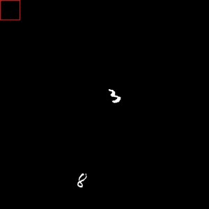

# SingleImageObjectDetection
Object Detection algorithms, even for simple object detection, even with transfer learning require hundreds of annotated images. This project explores a possible way where a generalized model can be used to identify if and where an object is present in an image.

#### Note: 
The Colab notebook and the process mentioned heavily follows the tutorials providied by pyimagesearch
1. siamese network: 
https://www.pyimagesearch.com/2020/11/30/siamese-networks-with-keras-tensorflow-and-deep-learning/
2. turning object classification network to object detection:
https://www.pyimagesearch.com/2020/06/22/turning-any-cnn-image-classifier-into-an-object-detector-with-keras-tensorflow-and-opencv/

## Problems

1. Object detection in an image is a complex task, even with transfer learning the process still requires hundreds (if not thousands) of annotated images.

2. The model would still have to be trained and interchanging to a customized the backbone requires working on the huge datasets and resources.

3. Some tasks, where we need to detect reasonably large objects in an image with prominent features when we have only a few images can be problematic and the model tends to easily overfit.

4. This huge process also needs time and hinders rapid prototyping.

## Goal

Explore if we can create an algorithm where we can use as low as single image to detect where an object is present in an image

## Approach

The approach consists of three main parts:

1. **Siamese Network** that compares two images and gives the similarity between them
2. **A sliding window** on a input image from which we extract Region of interests (ROI) and use the siamese network to calculate the probability of an object being present in the give ROI.
3. **Non max suppression** that process the various locations where the object is present based on confidences and nms thresh to give the most accurate location

A siamese network is trained on the MNIST dataset, it takes two digits and calculates the similarity between them.

The siamese network and the corresponding confidences of each ROI from sliding window approach is saved and NMS is applied on it to suppress incorrect and duplicate regions.

## Dataset

I have used the MNIST Hand written digits dataset to train the Siamese network and to create a dummy image where the object is present.

## Results

On the MNIST dataset the detected object (digit 3 here):

